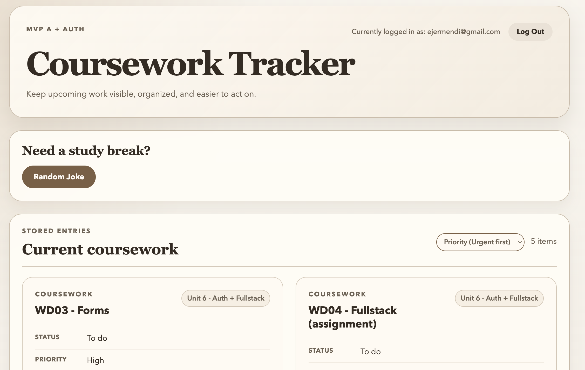

# Coursework Tracker

## Preview

---

## Purpose

A simple, intuitive tool to keep track of:

- Upcoming assignments
- Next steps in a course
- General coursework progress

The focus is on clarity and functionality over complexity, offering a streamlined experience for students and lifelong learners.

---

## Current Status — UI/UX Polish Phase (Completed)

The project has moved beyond the local MVP stage. It is now a fully deployed, production-ready web application featuring secure user authentication, persistent cloud storage, and a highly refined interface.

### Core Features Completed:

- **Production Deployment:** Live and accessible on the web.
- **Cloud Infrastructure:** Persistent storage via Supabase PostgreSQL.
- **Social Authentication:** Secure login via Google and GitHub OAuth.
- **Form Modal Overlays:** All data entry (Add/Edit) uses React Portals for a professional, full-screen experience.
- **Dark Mode:** Persistent theme toggle with an "Academic Noir" palette.
- **Audio Controls:** Randomized joke laughter with a persistent mute toggle and sound effects.
- **Spotify Integration:** Embedded study playlist with a refined, responsive layout.

---

## Tech Stack

- **Frontend:** React + TypeScript (Deployed via **Vercel**)
- **Backend:** Node.js + Express (Serverless/API handling)
- **Database:** PostgreSQL (Hosted via **Supabase**)
- **Authentication:** Supabase Auth (**Google & GitHub OAuth**)
- **State Management:** React Query (TanStack Query)
- **Styling:** Vanilla CSS with custom theme variables

---

## Future Scope / Next Steps

With the core infrastructure and UI polish in place, the next phases will focus on total consistency and advanced integration:

- **UI Refinement:** Identify and fix minor visual bugs across desktop and mobile web versions.
- **Spotify Web Playback SDK:** Investigate custom player integration for native volume control and deeper music management.
- **Data Visualization:** Build a dashboard showing coursework completion metrics and visual progress bars.
- **Task Management:** Implement a Kanban-style view for more intuitive task prioritization.

---

## Notes

This project remains intentionally focused as a high-value MVP:

- Clean, single-responsibility data models
- Scalable cloud infrastructure that avoids early over-engineering
- Designed specifically to be easily extended with new features based on real usage
